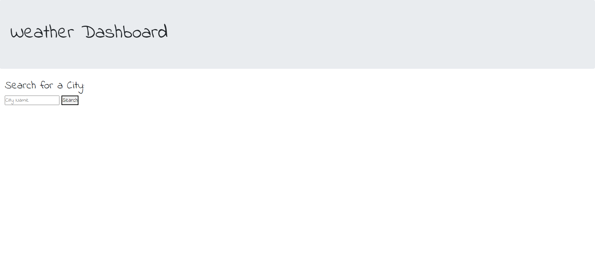

## Week 6 Homework

# Description

The main purpose of this project is to create a webpage that will allow the user to see the weather in multiple cities and the 5-day forecast.

To enable the user to look up the weather and forecast, I will be using multiple APIs from Openweather to retrieve the requested data. I will also be using Bootstrap to style the webpage.

The webpage is designed so that the current weather (temperature, humidity, wind speed, UV Index, and the weather icon) will be displayed when a city is entered into the search bar and the search button is pressed. In addition to the current weather, the 5-day forecast (temperature, humidity, wind speed, and the weather icon) will be displayed under the current weather.

You may find the project [here](https://andrewplee.github.io/Week-6-homework/).

# Installation

When I first started this project, I knew that I will be designing the webpage so that there will be a title, a search bar with the search button next to it and a list of buttons of the previously searched cities on the left side of the page, and two containers with one displaying the current weather and the other showing the 5-day forecast. Within the forecast container, each day will be presented in a smaller container, which most likely will be dynamically rendered in the script.

Moving onto the script, I wanted the webpage to render the previously entered city names as buttons below the search bar and the weather information, both current and forecast, to appear upon pressing the submit button. I first wanted to render the buttons of the previously entered cities. To make this happen, I knew that I will be using the local storage to save the city names and return them as buttons. Once the buttons are rendered and stayed on the webpage even after refreshing, the user will also be able to press on the city-named buttons to call the weather and forecast.

To get the data for current and forecast data, I first used the Geocoding API on Openweather to obtain the latitude and the longitude of a city. I then used the latitude and the longitude to pinpoint the location of the city and the "One Call API 1.0" will use the latitude and longitude to provide the current weather information on the targeted city. With the information obtained from the API, I will then display the current weather data on the webpage along with the date from Moment.js and the city name. In addition, the UV index will change color depending on how strong it is, green for UV under 3, yellow for UV under 8, red for UV under 11 and purple for UV equal and over 11.

As for the forecast, I followed a similar procedure as to how I obtained the current weather data by using the "5 Day/ 3 Hour Forecast API" to get the data for the next 5 days. With the data, I now render the forecast onto the webpage.

# Usage

This is the starting page.

This image displays the weather for San Diego and the UV index showing green. It also shows the previously searched cities.

This image displays the weather for Beijing and the UV index showing yellow.

This image displays the weather for Tokyo and the UV index showing red.

# Credits

[Moment](https://momentjs.com/) for providing the date and time

[Bootstrap](https://getbootstrap.com/docs/4.3/getting-started/introduction/) for its frontend toolkit

[Openweather API](https://openweathermap.org/api) for providing the weather APIs

# License

© 2022 Trilogy Education Services, LLC, a 2U, Inc. brand.
